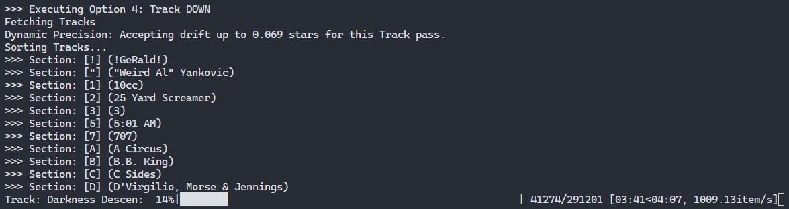

# Plex Bayesian Music Inference Engine

A Python-based utility for Plex Media Server that uses Bayesian math hierarchically to intelligently propagate ratings across your music library.

## The Motivation

Plex is great, and PlexAmp makes it even better. Especially with large music libraries, the Guest DJ and smart playlists make it easy to (re)discover your music. But these features are hobbled by the rating system. You have to individually rate each track for the app to be able to do anything with it.

For example, I like to start my morning listening to smooth jazz, so I've got a smart playlist that gathers tracks with that style. But I'd like to have it keep out tracks that I don't like (I hate vocal jazz; hopefully my programming is better than my taste), so I downvote those. But I can't put a rule into my smart playlist to only include tracks with a `userRating > 3`, because there are a lot of tracks that I just haven't rated at all yet. Similarly, although Plex doesn't document this, the common wisdom is that the auto DJ features will stay away from tracks rated `< 2.5`, but this is similarly limited by sparse rating data.

What if we could take what ratings you've got in your library, together with any critic ratings that Plex has in its metadata, and generalize them across related tracks. Specifically, if we've rated a few tracks on an album highly, then we should be able to call that album a "good" album; and on a good album, it's likely that any unrated tracks are good.

## The Concept

Standard Plex ratings are "flat". Rating a track doesn't influence the album, and rating an album doesn't influence the artist, so the ratings wind up being very sparse. This tool solves that problem with:

1. **Bottom-Up Inference:** Calculating Album and Artist ratings based on a Bayesian average of their children, the entire library, and the ratings of critics.
2. **Top-Down Inheritance:** Allowing unrated Tracks to inherit ratings from their parent Albums.
3. **Twin Extrapolation:** When you've got the same Track in multiple albums, setting its rating in one place should apply everywhere.

While doing this, it tracks which ratings it has inferred so that your own ratings will always be the data driving the calculations, and avoids turning the rating process into a feedback loop.

## Why Bayesian?

The rationale behind assuming that an unrated track should get the same rating (if known) as the album it appears on should be pretty obvious. But what about that business about using "Bayesian averages"? Well, imagine that you've got an album, and only one of its tracks is rated, with 5 stars. If we just set an album naively to the average of its tracks, then we'd set our hypothetical album to 5 overall. But that's almost certainly not correct: I'll bet that you've got far fewer "5" albums in your library than you have individual "5" tracks.

A better solution is to start from the assumption that any unrated track on the album is just the average across all tracks in your library, and let the known tracks on the album demonstrate that they should be better. So we start with a guess (this is the "Global Prior" you'll see output during processing) and let good and bad tracks on the album pull that average up or down.

And if Plex's metadata includes a rating from critics, then this data can be similarly incorporated. Thus, we integrate a bunch of information to come up with the best available guess of how good a given unrated track is.

## Key Features

- **Bayesian Priors:** Uses a "Confidence Constant" to ensure that a single 5-star track (or 1-star, for that matter) doesn't unfairly dictate an entire album's score.

- **Reversion to the mean**: Allows albums and artists to have scores "greater than the sum of their parts". The inference and inheritance of scores isn't just simple averaging.

- **Extrapolate "twin" ratings**: where multiple instances of a given track (e.g., an original studio album and a greatest hits compilation), apply ratings across the instances.

- **Critic Ratings:** Incorporate critic ratings (or don't) with a configurable weighting. Add/subtract a bias factor to better align critic ratings with the way you rate music.

- **Filter noise**: Avoid using down-votes for "band intro" tracks and other such filler material when aggregating ratings.

- **Non-Destructive:** Includes a full Cleanup/Undo mode to revert all script-applied ratings.

- **Shadow DB (Safe):** Uses a local file, `plex_state.json`, to distinguish between script-generated ratings and your manual ratings. It will never overwrite your manual work.

- **Tagging inferred data:**  Optionally add a `mood` tag to each track/album/artist so you can see which ratings are inferred.

- **Reporting:** Get reports showing Library Coverage, Rating Histogram, Twins Inventory, and Dissenters/Outliers.

- **Bulk edit/update**: Export data to a spreadsheet where you can do editing *en masse*, and upload in one go.
* **Restartable:** Massive libraries are handled via a phased, checkpoint-based approach. If something happens forcing it to stop partway through, you can restart with minimal wasted work.
  
  # Setup
1. Clone this repository.

2. Install dependencies: `pip install -r requirements.txt`

3. Create a `config.json` based on the provided template:

```
{
  "version": "1.4.0",
  "PLEX_URL": "http://your-server-ip:32400",
  "PLEX_TOKEN": "your-token-here",
  "LIBRARY_NAME": "Music",
  "CONFIDENCE_C": 3.0,
  "BIAS_CRITIC": 1.5,
  "WEIGHT_CRITIC": 3.0,
  "WEIGHT_GLOBAL": 1.0,
  "DRY_RUN": false,
  "INFERRED_TAG": "Rating_Inferred",
  "DYNAMIC_PRECISION": true,
  "COOLDOWN_BATCH": 50,
  "COOLDOWN_SLEEP": 5,
  "ALBUM_INHERITANCE_GRAVITY": 0.8,
  "TRACK_INHERITANCE_GRAVITY": 0.3,
  "BULK_ARTIST_FILENAME": "./artist_ratings.csv",
  "BULK_ALBUM_FILENAME": "./album_ratings.csv",
  "BULK_TRACK_FILENAME": "./track_ratings.csv",
  "TWIN_LOGIC": {
    "ENABLED": true,
    "DURATION_TOLERANCE_SEC": 5,
    "EXCLUDE_KEYWORDS": ["live", "demo", "reprise", "instrumental", "commentary", "acoustic", "remix"],
    "EXCLUDE_PARENTHESES": true,
    "EXCLUDE_LIVE_ALBUMS": true,
    "TWIN_TAG": ""
  },
  "UPWARD_EXCLUSION_RULES": {
    "ENABLED": true,
    "MIN_DURATION_SEC": 80,
    "KEYWORDS": ["intro", "outro", "interview", "skit", "applause", "commentary"],
    "CASE_SENSITIVE": false
  }
}
```

If no config file is found, it'll offer to create a default one for you. You'll still need to update it, especially with those first three settings. If you don't know what your Plex token is, read here:

https://support.plex.tv/articles/204059436-finding-an-authentication-token-x-plex-token/

Complete breakdown of the [config settings here](docs/config-settings.md).

## Usage

Run the script: `python rating_inference.py`

Select from the phases:

- **Option 0:** Run through the whole cycle, 1-5, automatically.

- **Options 1-2 (Up):** Generate Album/Artist ratings from Tracks.

- **Options 3-4 (Down):** Push inherited ratings to unrated child items.
* **Option 5:** Extrapolate ratings for twin Tracks to other copies of that same Track.
- **(A) Admin Tools:** Verify synchronization with Plex, Cleanup/Undo, Reconstruct State, Synchronize Plex Tags.

- **(B) Bulk Actions:** access the submenu to execute bulk actions (import/export).

- **(R) Reports:** access the submenu to run reports.

- **eXit:** Choose **X** to leave the app.

If you've got a reasonably-sized library, you can just choose 0 and let the whole thing run. But if you've got a large library, you'll probably want to do it in phases.

If you choose 1-4, you'll also get prompted for where to start. If you just hit enter to accept the default, you'll start at the beginning. But if you had previiously needed to interrupt the process midstream, this will allow you to skip the part you already completed, restarting from the letter it was processing when stopped. In other words, if you stopped processing in the middle of the letter "P", then you can pick up where you left off by entering "P" at this prompt, and it'll skip past everything up through "O", and just start on the P's.

If you want to automate running the tool, you can run it by including on the command line which Option you want to run. For example,

`python rating_inference.py 4`

This will behave exactly as if you'd run it interactively, requesting "4" at the prompt and then accepting the default of starting at the beginning of the library.

**Please** take advantage of the DRY_RUN feature to sanity check before running it for real. I don't want to feel bad because your library got mangled. Look in the `config.json` described above: if the setting for `DRY_RUN` is `true`, then it won't actually save the results back into Plex. When you're ready, change this setting to `false` to let the utility actually write the changes.

## The Initial "Baseline" Run

1. **Manual Rating Audit:** Before running the script for the first time, ensure your manual ratings are exactly where you want them. The script treats anything already rated (and not in the state file) as a "Manual Hijack" and will never touch it.

2. **Options 1 & 2 (The "Up" Pass):** Always run these first. This establishes your Artist and Album "Power Scores" based on your track-level taste.

3. **Options 3 & 4 (The "Down" Pass):** Run these only after you are satisfied with your Artist/Album scores. Option 4 (Track-Down) is the most intensive and should ideally be run overnight.

4. **Option 5 (Twins)**: The preceding stuff has propagated ratings across your whole library. Use this now to synchronize the ratings of tracks that appear in multiple different albums.



[**More detailed usage information here**](./docs/usage-details.md)

## IMPORTANT!!

* The program tracks its internal data by creating a file named plex_state.json. **DO NOT** delete this file!

* It's designed to operate on just one single library, and that plex_state.json file applies *only* to that library. If you want to run it against multiple different libraries, you'll need to juggle that file (e.g., rename it to correspond to your library, and make a copy of that to the base plex_state.json file when you run the utility for that library). There's a safety guard rail that will try to warn you if you mix this up. 

## Truth in Advertising

OK, enough with trying to sell you on using this. Why might you *not* want to use it?

Running this needs to move a lot of data to perform its calculations. Plex's internal database management is single-threaded, and its performance seems to get very noticeably worse for larger libraries. For really large libraries, a full initial run can take days if you use an `INFERRED_TAG`. Even a moderately-sized library might take a couple hours. 

## More Information

[Description of **Admin Menu** features](docs/admin-menu.md)

[Description of **Bulk Action** features](docs/bulk-action-menu.md)

[Description of **Reporting** features](docs/reports.md)

[Discussion of **computations** in the inference engine](docs/more-about-computation.md)

# Copyright and licensing

Code is copyright (c) 2026 by Chris Wuestefeld

Licensed under MIT License.